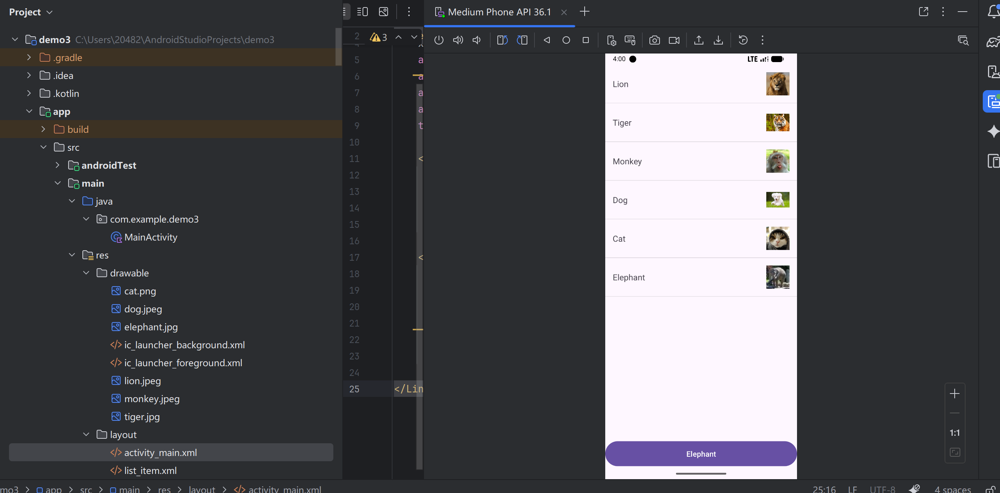
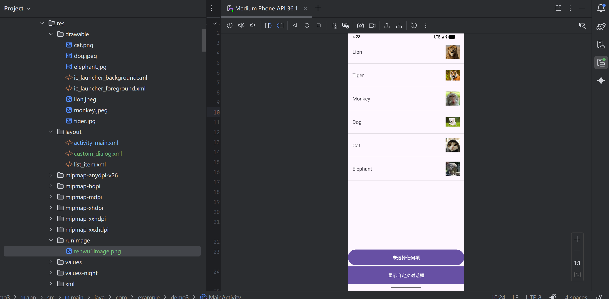
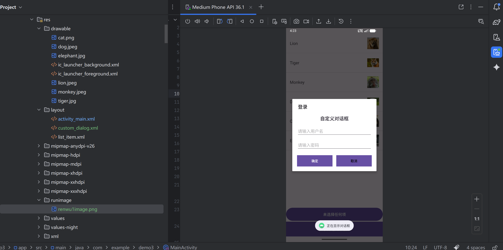
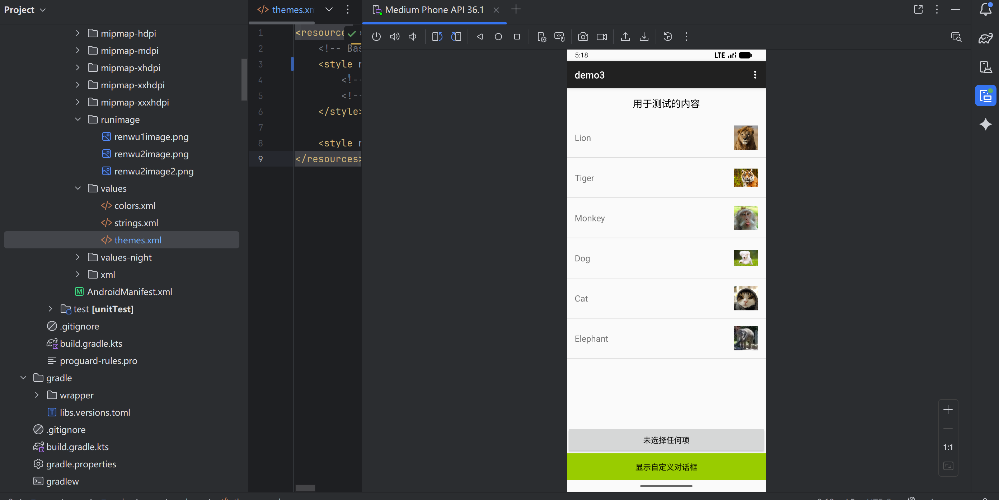
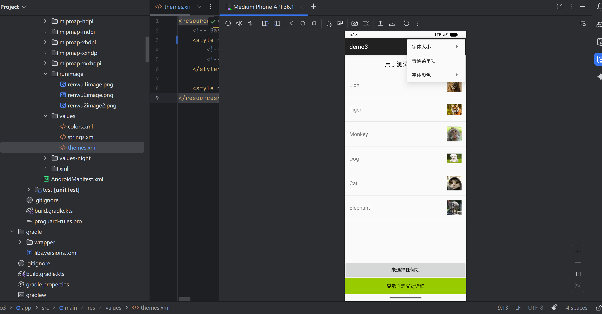
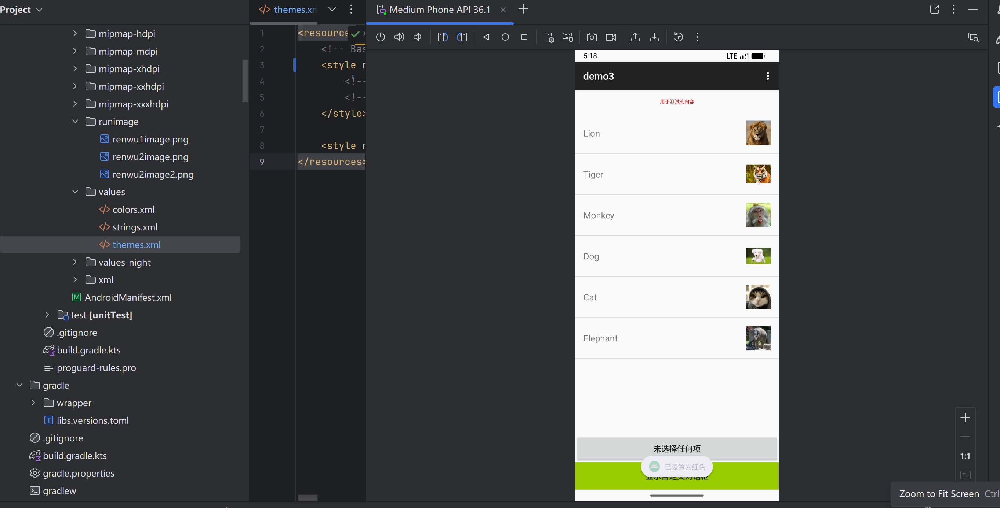
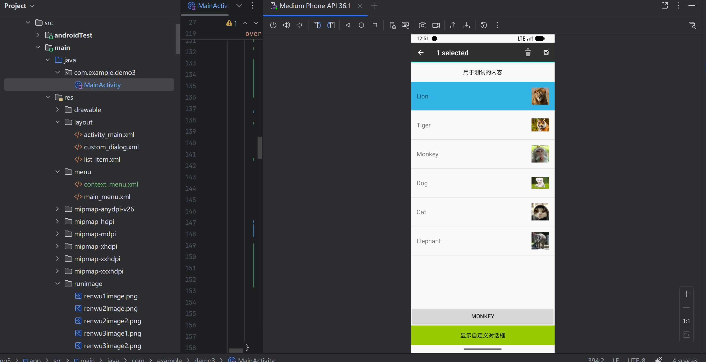

实验报告
课程   移动软件应用开发     实验名称    Android界面组件实验

专业___软件工程____________班级___2班 ______  学号__121052023072___  姓名 李承焕

实验日期：  2025  年  10 月 31日

一、实验目的
Android界面组件实验

二、实验内容
1.Android ListView的用法
2.创建自定义布局的AlertDialog
3.使用XML定义菜单
4.创建上下文操作模式(ActionMode)的上下文菜单

三、实验环境
Android studio

四、实验步骤
（1）任务一，listview：

（2）任务2，自定义布局dialog：

（3）任务3，xml自定义菜单：

（4）任务4，上下文菜单：

五、总结

本次实验主要完成了Android开发中常用的四种界面组件的实现和使用，包括ListView、自定义AlertDialog、XML菜单和上下文操作
模式。
通过这四个任务，深入理解了Android界面组件的基本用法和高级功能。通过本次实验，全面掌握了Android开发中常用的界面组件
的使用方法，从基础的列表显示到复杂的交互模式，建立了完整的Android界面开发知识体系。这些技能为后续更复杂的Android应用开发
奠定了坚实的基础。实验过程中遇到的问题和解决方案也为实际项目开发提供了宝贵的经验。
